### Hi all 👋
- 🧑🏻‍💻 I’m currently working on zhukehulian
- 🌱 I’m currently learning Multimodal Learning
- 👯 I’m looking to collaborate on Zero-shot learning
- 🌈 How to reach me: xiaqiankun@outlook.com


<!--
**AnonymousDestroyer/AnonymousDestroyer** is a ✨ _special_ ✨ repository because its `README.md` (this file) appears on your GitHub profile.
Here are some ideas to get you started:
- 🔭 I’m currently working on ...
- 🌱 I’m currently learning ...
- 👯 I’m looking to collaborate on ...
- 🤔 I’m looking for help with ...
- 💬 Ask me about ...
- 📫 How to reach me: ...
- 😄 Pronouns: ...
- ⚡ Fun fact: ...
-->

<!--START_SECTION:waka-->

```txt
From: 29 August 2023 - To: 05 September 2023

No activity tracked
```

<!--END_SECTION:waka-->

<div align="center">
    
    
</div>
