### Hi all 👋
- 🧑🏻‍💻 I’m currently working on zhukehulian
- 🌱 I’m currently learning Multimodal Learning
- 👯 I’m looking to collaborate on Zero-shot learning
- 🌈 How to reach me: xiaqiankun@outlook.com


<!--
**AnonymousDestroyer/AnonymousDestroyer** is a ✨ _special_ ✨ repository because its `README.md` (this file) appears on your GitHub profile.
Here are some ideas to get you started:
- 🔭 I’m currently working on ...
- 🌱 I’m currently learning ...
- 👯 I’m looking to collaborate on ...
- 🤔 I’m looking for help with ...
- 💬 Ask me about ...
- 📫 How to reach me: ...
- 😄 Pronouns: ...
- ⚡ Fun fact: ...
-->

<div align="center">
    <a href="https://github.com/xqk">
        
    </a>
</div>

<div align="center">
    
</div>

---

<div align="center">
    <strong>Languages</strong><br><br>
    <code></code>
    <code></code>
    <code></code>
    <code></code>
    <code></code>
    <code></code>
    <br><br><strong>Frameworks</strong><br><br>
    <code></code>
    <code></code>
    <code></code>
    <code></code>
    <code></code>
    <br><br><strong>Tools and Environments</strong><br><br>
    <code></code>
    <code></code>
    <code></code>
    <code></code>
    <code></code>
    <code></code>
    <code></code>
    <code></code>
    <code></code>
    <br><br><strong>Game Platform 😆</strong><br><br>
    <a href="https://steamcommunity.com/id/cwher/">
        <code></code>
    </a>
    <code></code>
</div>

---

:bar_chart: **These 30 days I spent my time on:**

<!--START_SECTION:waka-->

```txt
From: 22 September 2025 - To: 22 October 2025

Total Time: 6 hrs 56 mins

Other                      5 hrs 35 mins   🟩🟩🟩🟩🟩🟩🟩🟩🟩🟩🟩⬜⬜⬜⬜⬜⬜⬜⬜⬜⬜⬜⬜⬜⬜   44.58 %
Go                         1 hr 53 mins    🟩🟩🟩🟩⬜⬜⬜⬜⬜⬜⬜⬜⬜⬜⬜⬜⬜⬜⬜⬜⬜⬜⬜⬜⬜   15.07 %
Java                       1 hr 2 mins     🟩🟩⬜⬜⬜⬜⬜⬜⬜⬜⬜⬜⬜⬜⬜⬜⬜⬜⬜⬜⬜⬜⬜⬜⬜   08.31 %
Lua                        55 mins         🟩🟩⬜⬜⬜⬜⬜⬜⬜⬜⬜⬜⬜⬜⬜⬜⬜⬜⬜⬜⬜⬜⬜⬜⬜   07.32 %
YAML                       30 mins         🟩⬜⬜⬜⬜⬜⬜⬜⬜⬜⬜⬜⬜⬜⬜⬜⬜⬜⬜⬜⬜⬜⬜⬜⬜   04.03 %
```

<!--END_SECTION:waka-->

<div align="center">
    
    
</div>
